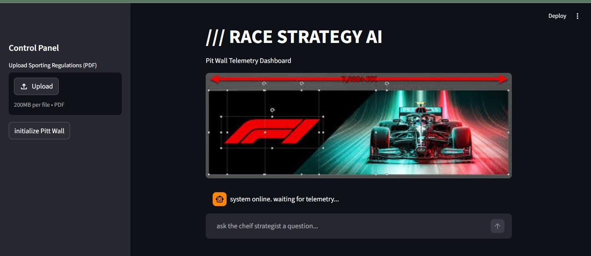

#  RACE STRATEGY AI: Pit Wall Telemetry Dashboard

A full-stack Retrieval-Augmented Generation (RAG) application designed to ingest, process, and interrogate complex document structures—specifically the official FIA Formula 1 Sporting Regulations.

This project utilizes a dual-engine architecture, combining a localized REST API backend with an interactive Streamlit frontend to simulate a live F1 Pit Wall environment. The AI acts as a Chief Race Strategist, answering complex penalty and procedural questions strictly using the provided telemetry (document context).

---


<p align="center">
  
</p>


---


#  Architecture & Tech Stack

- **Backend Server:** FastAPI (Python)
- **LLM Integration:** LangChain & Google Gemini API (`gemini-2.5-flash`)
- **Data Extraction:** PyPDF2
- **Frontend Dashboard:** Streamlit
- **Memory Management:** Persistent local file I/O (`telemetry.txt`) to bypass asynchronous worker amnesia

---

# Core Features

###  Custom RAG Pipeline
Ingests raw PDF documents, extracts text, and bundles the context with user queries before routing to the LLM.


###  Dual-Engine Deployment
Completely decoupled frontend and backend servers, allowing scalable API querying independent of the UI.

###  Interactive UI
Dark-mode dashboard featuring:

- Interactive document upload
- Asynchronous loading states
- Dynamic F1 trivia radio transmissions ("Toasts")

### Strict Persona Prompting
The LLM is constrained to maintain the precise, technical, low-key communication style of an F1 race engineer.

---

#  Project Structure

```text
F1-AI/
│
├── backend/
│   ├── .env                 # API Keys (Git-ignored)
│   ├── main.py              # FastAPI server & endpoints
│   ├── ai_integration.py    # LangChain prompt templates & Gemini routing
│   └── pdf_extractor.py     # Document parsing logic
│
├── frontend/
│   ├── app.py               # Streamlit dashboard
│   └── f1_header.jpg        # UI assets
│
├── requirements.txt         # Project dependencies
├── telemetry.txt            # Local persistent memory (auto-generated)
└── README.md
```

---

#  Installation & Setup

## 1. Clone the Repository

```bash
git clone https://github.com/yourusername/F1-Pit-Wall-AI.git
cd F1-Pit-Wall-AI
```

## 2. Install Dependencies

```bash
pip install -r requirements.txt
```

## 3. Configure Environment Variables

Create a `.env` file inside the `backend/` directory and add your Google Gemini API key:

```env
GEMINI_API_KEY=your_api_key_here
```

---

#  Running the Application

This project requires both the backend API and frontend dashboard to run simultaneously.

## Terminal 1 — Start the Backend (FastAPI)

Open your first terminal and run:

```bash
cd backend
uvicorn main:app --reload
```

The backend API will start locally.

---

## Terminal 2 — Start the Frontend (Streamlit)

Open a second terminal in the project root folder and run:

```bash
streamlit run frontend/app.py
```

Navigate to the localhost URL displayed in the terminal to initialize the Pit Wall dashboard.

---


#  Tech Requirements

Example dependencies you may include inside `requirements.txt`:

```txt
fastapi
uvicorn
streamlit
langchain
google-generativeai
python-dotenv
PyPDF2
```

---

#  License

This project is intended for educational and portfolio purposes. Modify and expand as needed.

---
